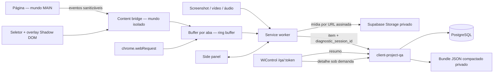

# WiControl QA — Especificação orientada a desenvolvimento

**Status:** proposta pronta para refinamento técnico  
**Versão:** 1.0  
**Data:** 27/09/2026  
**Escopo:** extensão Chrome Manifest V3 + receptor WiControl + Supabase  
**Inspirações:** VisBug e Jam.dev, adaptadas ao fluxo e ao modelo de dados do WiControl

---

## 1. Resumo executivo

O WiControl QA deve evoluir de uma ferramenta de captura para uma ferramenta de
**relato de defeitos reproduzíveis**. O fluxo-alvo é:

> selecionar o elemento com problema → registrar ou capturar a evidência → revisar
> console, rede, passos e ambiente coletados automaticamente → enviar um pacote de
> diagnóstico ao projeto correto → investigar tudo dentro do WiControl.

O produto combina dois princípios:

- do **VisBug**: interação direta com a página, seleção visual de elementos,
  inspeção de layout, acessibilidade e estados responsivos;
- do **Jam**: evidência visual acompanhada de console, requisições, passos de
  reprodução e metadados técnicos automáticos.

A recomendação não é reproduzir todas as funções dessas ferramentas. O foco deve
ser reduzir o tempo entre encontrar, reportar e diagnosticar um erro no processo
real da Wicomm.

### Resultado esperado

Um item de QA deixa de conter apenas descrição, imagem e URL e passa a poder conter:

- elemento afetado e sua localização visual;
- dispositivo real ou contexto de viewport;
- screenshot, vídeo e áudio/transcrição;
- erros do console e exceções JavaScript;
- requisições relevantes, com falhas destacadas;
- passos de reprodução;
- navegador, sistema, tela, viewport, locale e conexão;
- pacote técnico sanitizado, consultável sob demanda no WiControl.

---

## 2. Estado atual confirmado no repositório

### 2.1 Extensão

A extensão já possui uma fundação adequada:

- Manifest V3, Chrome mínimo 116;
- side panel persistente;
- captura de tela, recorte e anotação;
- gravação de vídeo da aba por `tabCapture` + documento offscreen;
- gravação de áudio e transcrição;
- mídia local em IndexedDB e estado em `chrome.storage`;
- upload privado por URL assinada;
- anexos de imagem, vídeo e áudio;
- idempotência para criação de mídia e item;
- autenticação por sessão Wiflow ou token de cliente;
- campos atuais: dispositivo, localização, descrição, prioridade, status,
  responsável, autor e URL.

Arquivos de referência:

- `manifest.json`
- `background/service-worker.js`
- `content/injected.js`
- `sidepanel/sidepanel.js`
- `shared/api-client.js`
- `supabase/functions/client-project-qa/`
- `supabase/migrations/202609120001_qa_media.sql`

### 2.2 Receptor WiControl

O receptor atual oferece:

- `GET /snapshot`;
- `POST /item` e `PUT /item`;
- `POST /comment`;
- pipeline adicional de mídia com `/media/init`, `/media/complete` e
  `/media/status` presente na base da extensão;
- tabela `qa_items` e tela `/qa/:token`;
- RLS fechado para dados de QA, com acesso mediado por Edge Function;
- listagem, filtros, responsáveis, comentários e imagens.

### 2.3 Lacunas entre extensão e receptor

| Área | Situação atual | Lacuna |
|---|---|---|
| Evidência | Pipeline privada aceita imagem, vídeo e áudio | UI e contrato legado ainda privilegiam/obrigam imagem |
| Elemento | Não há elemento DOM associado | Desenvolvedor precisa localizar manualmente o componente |
| Console | Não coletado | Erros e logs se perdem antes da abertura do DevTools |
| Rede | Não coletada | Falhas HTTP não acompanham o relato |
| Reprodução | Descrição livre | Passos dependem da memória do relator |
| Ambiente | URL e dispositivo manual | Faltam browser, OS, viewport, DPR, locale e conexão |
| Mobile | Campo manual `Mobile` | Não distingue dispositivo real, viewport ou emulação |
| Diagnóstico | Não há entidade própria | Logs grandes não devem inflar `qa_items` ou `/snapshot` |
| Privacidade | Mídia privada e RLS forte | Faltam regras específicas para segredos em logs/rede |

---

## 3. Objetivos e métricas

### 3.1 Objetivos de produto

1. Criar um item completo sem sair da página testada.
2. Dar ao desenvolvedor contexto suficiente para iniciar a investigação sem pedir
   dados básicos ao QA.
3. Tornar a seleção de elemento e dispositivo inequívoca.
4. Manter o WiControl como local de triagem e consulta.
5. Coletar somente o necessário, com consentimento visível e sanitização.

### 3.2 Métricas de sucesso

| Métrica | Baseline | Meta após 60 dias |
|---|---:|---:|
| Mediana entre abrir extensão e enviar item | medir | ≤ 60 s |
| Itens com elemento ou evidência visual | medir | ≥ 85% |
| Itens com pacote técnico válido | 0% | ≥ 70% em domínios habilitados |
| Itens que exigem pergunta de contexto básico | medir | redução de 40% |
| Falha no envio de item | medir | < 1% |
| Impacto de CPU da coleta em repouso | n/a | < 2% médio no cenário de teste |
| Memória por aba monitorada | n/a | ≤ 10 MB, alvo ≤ 5 MB |

### 3.3 Não objetivos do primeiro ciclo

- substituir Chrome DevTools;
- editar permanentemente o site;
- capturar corpo completo de toda requisição;
- guardar cookies, tokens, senhas ou cabeçalhos de autenticação;
- executar em páginas `chrome://`, Chrome Web Store ou outras páginas protegidas;
- prometer emulação idêntica a um aparelho físico;
- criar integração externa com Jira, Linear ou Slack antes de consolidar o
  WiControl como receptor.

---

## 4. Personas e trabalhos principais

### QA / atendimento

“Quando encontro um problema, quero apontar o elemento, mostrar o ocorrido e
enviar o contexto automaticamente, para não montar um relatório técnico à mão.”

### Desenvolvedor

“Quando recebo um item, quero ver evidência, requisição que falhou, erro de
console, passos e ambiente na mesma linha do tempo, para começar pela causa mais
provável.”

### Gestão

“Quero saber se os relatos são investigáveis, sem expor dados de clientes nem
aumentar descontroladamente o armazenamento.”

---

## 5. Princípios de experiência

1. **Capturar primeiro, enriquecer automaticamente.** Campos manuais existem só
   quando acrescentam decisão humana.
2. **Um clique deve ter retorno visual.** Seleção, gravação, pausa e envio precisam
   de estado explícito.
3. **O relator controla o que sai do navegador.** Console, rede, passos e mídia
   aparecem em uma revisão antes do envio.
4. **Contexto técnico é progressivo.** Resumo primeiro; detalhes e payloads sob
   demanda.
5. **Mobile é contexto, não apenas etiqueta.** O item registra como foi observado.
6. **Toda captura é limitada.** Ring buffers, TTL, limites por tamanho e descarte
   após o vínculo evitam coleta indefinida.

---

## 6. Experiência proposta

### 6.1 Estado do side panel

O side panel terá quatro blocos:

1. **Contexto:** projeto, página e indicador de monitoramento;
2. **Capturar:** selecionar elemento, screenshot, vídeo e áudio;
3. **Diagnóstico:** contadores de console, rede e passos, com revisão;
4. **Relato:** descrição, dispositivo, local, prioridade, status e responsável.

### 6.2 Fluxo principal

1. Usuário abre o side panel.
2. Extensão identifica projeto/domínio e mostra se a coleta está ativa.
3. Usuário escolhe `Selecionar elemento` e clica no alvo.
4. Extensão realça o elemento e registra seu contexto.
5. Usuário tira screenshot ou grava vídeo; o alvo pode ser destacado na imagem.
6. Usuário abre `Diagnóstico` e vê somente registros da janela associada ao relato.
7. Extensão sugere dispositivo, localização e descrição inicial.
8. Usuário remove qualquer dado que não queira enviar.
9. Envio cria item, anexa mídias e associa o pacote diagnóstico.
10. WiControl abre o item com resumo e abas técnicas.

### 6.3 Modos de captura

| Modo | Uso | Saída |
|---|---|---|
| Elemento | Bug visual ou de interação localizado | descriptor DOM + screenshot opcional |
| Área | Problema visual mais amplo | screenshot recortado/anotado |
| Página visível | Estado geral | screenshot do viewport |
| Vídeo | Fluxo ou bug intermitente | vídeo + eventos/logs sincronizados |
| Áudio | Descrição rápida | áudio + transcrição revisável |
| Diagnóstico sem mídia | Erro técnico claro | contexto técnico + descrição |

Após o backend aceitar anexos e diagnóstico sem imagem, uma imagem deixa de ser
obrigatória. A regra passa a ser: **ao menos uma evidência entre mídia, elemento,
erro de console, requisição com falha ou descrição detalhada**.

---

## 7. Seletor de elementos

### 7.1 Requisitos funcionais

**SEL-01 — ativação.** O botão `Selecionar elemento` ativa um overlay na aba e
altera o cursor para inspeção.

**SEL-02 — hover.** Ao mover o ponteiro, o elemento sob o cursor recebe contorno,
dimensões e rótulo compacto com tag, id/classe e nome acessível.

**SEL-03 — seleção.** Clique fixa o alvo. `Esc` cancela; `Enter` confirma; setas
sobem/descem na árvore DOM; `Shift+clique` permite seleção múltipla, limitada a 10.

**SEL-04 — isolamento.** A UI injetada usa Shadow DOM e z-index máximo, sem herdar
CSS da página e sem alterar o layout.

**SEL-05 — descriptor.** Para cada elemento, registrar:

- seletor CSS estável e verificado como único quando possível;
- caminho alternativo e cadeia de iframe/shadow host;
- tag, `id`, classes limitadas, `role` e nome acessível;
- `data-testid`, `name` ou atributos semânticos permitidos;
- retângulo no viewport e na página;
- trecho HTML sanitizado, máximo de 4 KB;
- estilos computados selecionados: display, position, box model, tipografia,
  cor, contraste, z-index e overflow;
- estado: visible, disabled, checked, expanded e focused;
- problemas rápidos de acessibilidade.

**SEL-06 — seletor estável.** A prioridade do algoritmo será:

1. `data-testid`, `data-test`, `data-cy` ou identificador configurado;
2. `id` único que não pareça gerado;
3. semântica (`role`, `name`, `aria-label`) combinada com tag;
4. classes estáveis;
5. cadeia curta com `:nth-of-type` somente como fallback.

**SEL-07 — limites.** Elementos em iframe cross-origin podem ser identificados até
o frame, mas seu DOM interno só pode ser inspecionado quando a extensão tiver
acesso àquela origem. Closed shadow roots não são atravessados.

### 7.2 Inspeção útil inspirada no VisBug

O primeiro ciclo mostra, sem permitir edição:

- box model e dimensões;
- distância básica até pai/irmãos;
- tipografia e cores;
- overflow/corte;
- nome acessível, role e contraste;
- posição e ordem DOM.

Edição temporária de texto/CSS, multiseleção avançada, alinhamento e nudge entram
como experimento posterior. Se adotadas, todas as mutações devem ter `Desfazer` e
`Restaurar página`, além de um diff explícito anexável ao relato. Nada é persistido
no site.

### 7.3 Critérios de aceite

- overlay não desloca elementos em páginas de teste;
- seleção funciona em SPA após mudança de rota;
- seletor reencontra o mesmo elemento em pelo menos 95% do corpus estável de QA;
- dados de inputs `password` nunca aparecem no descriptor;
- overlay é removido antes de screenshot e restaurado depois quando necessário;
- `Esc` sempre encerra o modo e devolve o foco anterior.

---

## 8. Desktop, mobile e contexto responsivo

O campo existente `device` continuará compatível:

- `Desktop`;
- `Mobile`;
- `Mob&Desk` — exibido na UI como `Desktop e mobile`.

Ele será acompanhado por `device_context`, que explica a observação:

```json
{
  "classification": "Mobile",
  "source": "auto|manual|preset",
  "is_emulated": false,
  "viewport": { "width": 390, "height": 844 },
  "screen": { "width": 390, "height": 844 },
  "device_pixel_ratio": 3,
  "orientation": "portrait",
  "touch_capable": true,
  "user_agent": "redacted/normalized",
  "preset": null
}
```

### 8.1 Seletor de contexto

- sugestão automática: mobile se viewport ≤ 767 px ou ponteiro primário coarse;
- escolha manual sempre prevalece;
- ação `Aplicar aos dois` marca `Mob&Desk`;
- o resumo mostra `Mobile real`, `Viewport mobile em desktop` ou `Desktop`, em vez
  de chamar qualquer janela estreita de “emulação”.

### 8.2 Presets responsivos

Primeira entrega: botões para abrir uma **janela de teste redimensionada** com
presets configuráveis, por exemplo 390×844, 768×1024 e 1440×900. A UI deve avisar
que isso testa viewport responsivo e não reproduz integralmente navegador, touch,
DPR ou hardware de um aparelho.

Emulação fiel por Chrome DevTools Protocol não faz parte do produto padrão porque
exige a permissão `debugger`, ampla e não opcional. Ela pode ser avaliada em uma
distribuição interna separada se houver necessidade comprovada.

### 8.3 Comparação responsiva futura

Uma fase posterior poderá criar duas evidências vinculadas, Desktop e Mobile, e
mostrar comparação lado a lado no WiControl. Não deve usar iframe como solução
geral, pois muitos sites bloqueiam incorporação.

---

## 9. Console da página

### 9.1 Coleta

Capturar a partir de `document_start`:

- `console.debug`, `info`, `log`, `warn` e `error`;
- `window.error`;
- `unhandledrejection`;
- stack trace quando disponível;
- origem, timestamp relativo e frame.

Um bootstrap mínimo roda no mundo `MAIN` para observar APIs da página e envia
registros serializados a uma ponte no mundo isolado. A ponte valida o formato,
aplica limites e armazena o buffer. A página é considerada origem não confiável:
nenhuma mensagem recebida pode executar código da extensão.

### 9.2 Serialização e limites

- máximo de 500 entradas ou 2 MB por aba, o que ocorrer primeiro;
- retenção padrão: últimos 2 minutos;
- strings: máximo 4 KB por argumento;
- objetos: profundidade 4, máximo 50 chaves por nível;
- referências circulares viram `[Circular]`;
- nós DOM viram descriptor curto, nunca o objeto vivo;
- níveis `warn` e `error` têm prioridade quando o buffer precisa descartar itens;
- logs repetidos são agrupados com contador.

### 9.3 UI

No side panel:

- abas `Todos`, `Erros`, `Avisos`;
- busca;
- contador por nível;
- seleção individual e `Incluir erros automaticamente`;
- indicador de registros removidos por limite ou privacidade.

No WiControl:

- resumo: `3 erros · 2 avisos`;
- lista cronológica virtualizada;
- stack recolhível e ação `Copiar`;
- sincronização com o instante do vídeo quando houver.

---

## 10. Requisições de rede

### 10.1 Estratégia padrão

Usar duas fontes complementares:

1. instrumentação de `fetch` e `XMLHttpRequest` no mundo `MAIN`, para duração,
   correlação e contexto da aplicação;
2. `chrome.webRequest` em modo somente observação, para ciclo de vida e falhas de
   recursos que não passam por fetch/XHR.

Não bloquear, redirecionar nem modificar tráfego.

### 10.2 Dados permitidos por requisição

- ID de correlação;
- método;
- URL sanitizada;
- tipo do recurso;
- status HTTP ou código de erro;
- início, fim e duração;
- iniciador/origem;
- tamanho quando disponível;
- indicação same-origin/cross-origin;
- cabeçalhos de resposta em allowlist estrita, se necessários;
- preview opcional de JSON somente para requisições same-origin e após sanitização.

### 10.3 O que não coletar por padrão

- `Authorization`, `Cookie`, `Set-Cookie`, chaves de API e tokens;
- corpos de formulário;
- upload de arquivos;
- valores de password, cartão, CPF, e-mail ou telefone;
- query params não permitidos;
- corpo binário;
- respostas maiores que o limite;
- tráfego da própria extensão e do Supabase de upload.

### 10.4 Limites

- máximo de 300 requisições ou 3 MB por aba;
- preview de request/response desabilitado no MVP;
- quando habilitado: máximo 32 KB por lado e somente tipos textuais permitidos;
- URLs iguais e consecutivas podem ser agrupadas;
- 4xx, 5xx, falhas e duração acima do limiar são preservadas primeiro.

### 10.5 UI

- filtros `Falhas`, `Lentas`, `XHR/Fetch`, `Documentos`, `Assets`;
- destaque para 4xx/5xx, erro de rede e timeout;
- waterfall simplificado;
- detalhes com URL sanitizada, timing e erro;
- ação para incluir/excluir individualmente antes do envio.

### 10.6 Critérios de aceite

- fetch e XHR continuam com a mesma interface observável pela aplicação;
- corpos, streams e respostas não são consumidos pela instrumentação;
- requisições da extensão não aparecem no relatório;
- nenhum segredo da lista de bloqueio chega ao payload de upload;
- 100% dos cenários de teste 4xx, 5xx e falha DNS/offline aparecem no resumo.

---

## 11. Passos de reprodução e linha do tempo

Capturar, após habilitação do domínio:

- navegação e mudança de rota SPA;
- clique em elemento interativo;
- submit;
- mudança de select/checkbox/radio sem valor sensível;
- foco em campo, registrado como “preencheu campo X”, sem conteúdo digitado;
- início, pausa e fim de gravação;
- seleção do elemento afetado;
- screenshot.

Cada evento contém `timestamp_offset_ms`, tipo e descriptor semântico do alvo. A
linha do tempo associa vídeo, console e rede pela mesma origem de tempo.

Exemplo:

```json
{
  "at_ms": 4210,
  "type": "click",
  "target": {
    "role": "button",
    "accessible_name": "Finalizar compra",
    "selector": "[data-testid='checkout-submit']"
  }
}
```

Valores digitados nunca são registrados. Para elementos com `data-private`,
`data-wiqa-mask`, `autocomplete` sensível ou dentro de uma área configurada como
privada, nem o nome acessível nem o texto do alvo são enviados.

---

## 12. Metadados de ambiente

Coletar uma vez por sessão de diagnóstico:

- URL sanitizada, título e origem;
- data/hora UTC e timezone;
- navegador e versão principal;
- sistema operacional normalizado;
- viewport, tela, DPR e orientação;
- touch capability;
- locale e idiomas;
- estado online/offline;
- `navigator.connection` quando suportado, limitado a effectiveType e rtt
  aproximado;
- versão da extensão;
- versão/build do site quando fornecida por configuração ou meta tag;
- ambiente inferido/configurado: local, desenvolvimento, staging ou produção;
- feature flags apenas por allowlist explícita.

Não guardar o user-agent bruto se os campos normalizados forem suficientes.

---

## 13. Sugestões adicionais priorizadas

### P0 — indispensáveis

- seletor de elemento;
- dispositivo + viewport automáticos com override;
- console e erros JavaScript;
- rede com falhas/duração, sem bodies;
- passos de reprodução sem valores;
- revisão e remoção antes do envio;
- visualização de diagnóstico no WiControl;
- regras de privacidade, limites e retenção.

### P1 — alto valor

- comparação Desktop/Mobile como duas evidências relacionadas;
- checagens rápidas de acessibilidade do elemento;
- screenshot da página inteira;
- pausa global de monitoramento por domínio;
- perfis de domínio/projeto com regras de máscara;
- geração assistida de título, resumo e passos a partir do pacote já sanitizado;
- detecção de possível duplicata por URL, selector, erro e janela de tempo;
- exportação JSON/HAR sanitizada para desenvolvedores;
- atalho de teclado e menu de contexto `Reportar no WiControl`.

### P2 — validar antes de construir

- edição temporária de texto e CSS com diff;
- alinhamento, medidas e nudge ao estilo VisBug;
- replay retroativo visual;
- métricas Web Vitals e snapshot de performance;
- transformação do item de QA em tarefa Wiflow mantendo vínculo bidirecional;
- distribuição interna com CDP/`debugger` para diagnóstico profundo;
- integração com error tracking, caso a Wicomm adote uma fonte canônica.

### Fora de escopo até nova decisão

- gravação contínua de todas as abas;
- keylogging;
- clonagem do painel Elements/Network do DevTools;
- edição permanente de DOM/CSS;
- automação de testes E2E dentro da extensão.

---

## 14. Arquitetura proposta



### 14.1 Componentes novos na extensão

| Componente | Responsabilidade |
|---|---|
| `page-observer.js` | instrumentar console, erros, fetch/XHR e eventos no MAIN |
| `diagnostic-bridge.js` | validar, sanitizar, limitar e encaminhar no ISOLATED |
| `element-selector.js` | hover, seleção, descriptor e checagens rápidas |
| `diagnostic-buffer.js` | buffers, janela temporal, agrupamento e descarte |
| `redaction.js` | regras compartilhadas e testes de vazamento |
| `diagnostic-store.js` | persistência temporária por aba/sessão |
| `diagnostic-client.js` | init/upload/complete e vínculo do bundle |

### 14.2 Persistência no navegador

- memória do content script para eventos quentes;
- `chrome.storage.session` para resumo e recuperação do service worker;
- IndexedDB da extensão para bundle/mídia maior durante o rascunho;
- dados particionados por `tabId + documentId + sessionId`;
- limpeza ao enviar, descartar, expirar ou fechar a aba;
- TTL local padrão de 24 horas para rascunhos não enviados.

---

## 15. Modelo de dados no WiControl

Logs não devem ser adicionados diretamente a `qa_items` nem retornados dentro de
todo `/snapshot`. A abordagem recomendada é um registro indexável e um bundle
privado de detalhes.

### 15.1 `qa_diagnostic_sessions`

| Campo | Tipo | Observação |
|---|---|---|
| `id` | UUID PK | ID público do diagnóstico |
| `project_id` | UUID FK | mesmo projeto do item |
| `qa_item_id` | UUID FK nullable | preenchido ao vincular |
| `client_request_id` | UUID | idempotência |
| `schema_version` | INTEGER | iniciar em 1 |
| `status` | TEXT | created/uploaded/ready/failed/expired |
| `bucket` | TEXT | bucket privado |
| `object_path` | TEXT | JSON gzip/JSON compactado |
| `size_bytes` | BIGINT | limite do bundle |
| `sha256` | TEXT | integridade |
| `summary` | JSONB | contagens e destaques seguros |
| `environment` | JSONB | metadados pequenos e sanitizados |
| `element_summary` | JSONB | alvo principal sem HTML extenso |
| `capture_started_at` | TIMESTAMPTZ | início da janela |
| `capture_ended_at` | TIMESTAMPTZ | fim da janela |
| `expires_at` | TIMESTAMPTZ | política de retenção |
| `created_by` | JSONB | autor resolvido |
| timestamps | TIMESTAMPTZ | criação/atualização |

RLS deve ser habilitado sem policies para `anon`/`authenticated`, seguindo o
padrão de QA já adotado; somente a Edge Function usa `service_role`.

### 15.2 Alteração mínima em `qa_items`

Adicionar `diagnostic_session_id UUID NULL` ou uma tabela de vínculo
`qa_item_diagnostics`. Preferir tabela de vínculo se um item puder receber mais de
um diagnóstico durante comentários/validação.

Recomendação:

```text
qa_item_diagnostics
  qa_item_id UUID FK
  diagnostic_session_id UUID FK
  kind TEXT ('initial', 'comment', 'verification')
  sort_order INTEGER
  created_at TIMESTAMPTZ
  UNIQUE (qa_item_id, diagnostic_session_id)
```

### 15.3 Bundle versão 1

```json
{
  "schema_version": 1,
  "session": {
    "id": "uuid",
    "started_at": "ISO-8601",
    "ended_at": "ISO-8601",
    "page_url": "https://site/path"
  },
  "environment": {},
  "device_context": {},
  "elements": [],
  "console": [],
  "network": [],
  "steps": [],
  "timeline": [],
  "redaction": {
    "policy_version": 1,
    "removed_fields": 12,
    "truncated_entries": 3
  }
}
```

### 15.4 Limites de servidor sugeridos

- bundle compactado: 5 MB no MVP;
- console: 500 itens;
- rede: 300 itens;
- passos: 200 itens;
- elementos: 10;
- duração da janela: 5 minutos, padrão 2;
- HTML total sanitizado: 20 KB;
- rejeitar schema desconhecido, tamanho divergente e hash inválido.

---

## 16. API proposta

Manter autenticação e idempotência já usadas pela extensão.

### 16.1 Criar upload de diagnóstico

`POST /diagnostics/init`

```json
{
  "token": "project-share-token",
  "client_request_id": "uuid",
  "schema_version": 1,
  "size_bytes": 123456,
  "sha256": "hex",
  "summary": {
    "console_errors": 3,
    "console_warnings": 2,
    "network_failures": 1,
    "steps": 7,
    "has_element": true
  },
  "environment": {},
  "element_summary": {}
}
```

Resposta: `diagnostic_session_id`, URL assinada curta, path e expiração.

### 16.2 Finalizar

`POST /diagnostics/complete`

Valida objeto, tamanho e hash; muda estado para `ready`.

### 16.3 Criar item

Extender `POST /item`:

```json
{
  "token": "project-share-token",
  "item": { "...": "campos existentes" },
  "attachment_ids": ["uuid"],
  "diagnostic_session_ids": ["uuid"]
}
```

O servidor valida que mídia e diagnóstico pertencem ao mesmo projeto e que ainda
não estão vinculados a item incompatível. A operação de criação/vínculo deve ser
atômica e idempotente.

### 16.4 Consultar

- `GET /item/diagnostics?token=...&itemId=...` retorna resumos;
- `GET /diagnostics/detail?token=...&diagnosticId=...&section=console` retorna a
  seção solicitada, paginada ou por URL assinada curta;
- o endpoint sempre revalida acesso ao projeto;
- detalhes nunca entram no snapshot geral.

### 16.5 Compatibilidade

- clientes antigos continuam enviando `image_urls`;
- `attachments` e `diagnosticSummary` são campos opcionais de resposta;
- `image_url` e `image_urls` permanecem durante a migração;
- o novo validador aceita item sem imagem somente quando há attachment,
  diagnóstico útil ou regra explícita equivalente;
- contratos recebem testes de compatibilidade v1/v2.

---

## 17. WiControl: visualização e triagem

Cada card/linha de QA mostra badges compactas quando existirem:

- elemento selecionado;
- quantidade de erros;
- quantidade de requisições com falha;
- vídeo/áudio;
- Desktop, Mobile ou ambos.

Ao abrir detalhes:

1. **Resumo:** descrição, status, responsável e destaques técnicos;
2. **Evidências:** imagens, vídeo, áudio e transcrição;
3. **Elemento:** screenshot focal, seletor, box model, estilos e a11y;
4. **Console:** logs filtráveis;
5. **Rede:** lista/waterfall e falhas;
6. **Passos:** linha do tempo reproduzível;
7. **Ambiente:** dispositivo e versões.

As seções técnicas são carregadas somente ao abrir. Logs usam virtualização e
texto monoespaçado. O bundle bruto pode ser baixado apenas por usuário interno com
permissão adequada; cliente externo vê somente o subconjunto definido pela
política do projeto.

---

## 18. Privacidade, segurança e conformidade

### 18.1 Consentimento e transparência

- monitoramento técnico desativado até o usuário habilitar no domínio/projeto;
- indicador visível `Monitoramento ativo` no side panel;
- ações `Pausar`, `Limpar dados desta aba` e `Desativar neste domínio`;
- revisão pré-envio com contagens e exclusão por seção;
- tela explica o que é e não é capturado.

### 18.2 Sanitização em duas camadas

Aplicar no navegador e repetir no servidor:

- nomes de chaves case-insensitive: password, passwd, secret, token, api-key,
  authorization, cookie, cpf, card, cvv e variantes configuráveis;
- mascarar query params fora de allowlist;
- remover fragmento da URL;
- limitar texto e profundidade antes de persistir;
- bloquear origem/path configurado;
- permitir `[data-wiqa-mask]` e seletores privados por projeto;
- nunca confiar que o cliente já sanitizou.

### 18.3 Armazenamento e acesso

- bucket privado e URLs assinadas curtas;
- RLS habilitado, sem policy pública;
- bundle associado obrigatoriamente ao projeto autenticado;
- trilha de acesso para download de bundle bruto;
- retenção configurável, padrão sugerido de 90 dias após conclusão/cancelamento;
- limpeza de uploads órfãos em 24 horas;
- hash de integridade e schema versionado;
- CSP da extensão sem código remoto ou `eval`.

### 18.4 Permissões Chrome

Usar o mínimo necessário. `webRequest` só entra quando a funcionalidade estiver
pronta e documentada; não usar `webRequestBlocking`. A permissão `debugger` não
entra no manifesto padrão. Avaliar substituir `<all_urls>` obrigatório por acesso
opcional/por domínio em uma evolução, considerando o funcionamento da captura.

---

## 19. Requisitos não funcionais

### Desempenho

- instrumentação não pode bloquear o thread principal por mais de 16 ms em lote;
- serialização em lotes, no máximo a cada 250 ms ou 50 eventos;
- nenhum clone de body/response no MVP;
- overlay responde ao hover em até 50 ms no p95;
- tela de detalhes abre resumo em até 1 s com bundle já disponível.

### Resiliência

- service worker reiniciado recupera resumo e rascunho;
- falha no diagnóstico não impede envio de descrição/mídia;
- falha parcial é informada: “item criado, diagnóstico não anexado” com retry;
- todas as mutações remotas usam idempotência;
- mudança de rota SPA não duplica listeners.

### Acessibilidade

- fluxo completo por teclado;
- foco restaurado ao fechar overlays;
- estados anunciados por região live;
- contraste AA;
- não depender apenas de cor para nível de log/status.

### Compatibilidade

- Chrome 116+ como baseline atual;
- testar Chromium Edge;
- páginas SPA, navegação tradicional, iframe same-origin e Shadow DOM aberto;
- falha explicada em páginas protegidas do navegador.

---

## 20. Critérios de aceite ponta a ponta

### Cenário A — bug visual Desktop

**Dado** um projeto conectado e a página em viewport Desktop  
**Quando** o QA seleciona um botão, captura, anota e envia  
**Então** o item contém device Desktop, viewport, descriptor único, imagem e
resumo técnico consultável no WiControl.

### Cenário B — erro de API no mobile

**Dado** um viewport de 390×844 e monitoramento ativo  
**Quando** uma chamada retorna 500 e o usuário reporta o problema  
**Então** o item contém contexto Mobile, passo relacionado, requisição 500,
duração e erros de console, sem cookies, authorization ou body sensível.

### Cenário C — relato por vídeo

**Dado** uma gravação em andamento  
**Quando** ocorrem clique, erro de console e falha de rede  
**Então** todos aparecem em uma linha do tempo com offsets compatíveis com o vídeo.

### Cenário D — privacidade

**Dado** login com e-mail, senha e token em query string  
**Quando** o pacote é preparado  
**Então** senha, valor digitado, e-mail e token não existem no bundle local final,
na requisição de upload, no banco nem na visualização.

### Cenário E — degradação graciosa

**Dado** que o upload do diagnóstico falhou  
**Quando** a mídia e o item puderem ser enviados  
**Então** o item é criado, o usuário vê o estado parcial e pode reenviar somente o
diagnóstico sem duplicar o item.

---

## 21. Estratégia de testes

### Unidade

- gerador de seletor estável;
- serializador de console;
- redaction de URLs, objetos e cabeçalhos;
- ring buffer e prioridades de descarte;
- normalização de device/viewport;
- schema e migração de bundle;
- correlação temporal;
- compatibilidade dos contratos antigos.

### Integração da extensão

- ponte MAIN → ISOLATED com mensagens malformadas e spoofadas;
- fetch/XHR preservando comportamento, erro, stream e abort;
- ciclo `webRequest` correlacionado;
- reinício do service worker;
- navegação/reload/SPA;
- screenshot sem overlay;
- IndexedDB e limpeza por TTL;
- limite de quota de `chrome.storage.session`.

### Backend

- migrations por replay completo;
- RLS sem acesso `anon`/`authenticated` direto;
- upload assinado, hash/tamanho e expiração;
- vínculo cross-project rejeitado;
- idempotência concorrente;
- sanitização server-side;
- autorização interna e cliente em cada endpoint.

### E2E

Criar um site-fixture com:

- erros de console e promise rejeitada;
- fetch 200/400/500/lento/offline;
- campos sensíveis;
- SPA, iframe, Shadow DOM aberto e lista dinâmica;
- breakpoints mobile/desktop;
- elementos com IDs estáveis e gerados.

Executar a matriz Chrome 116, versão estável atual e Edge atual.

---

## 22. Plano de entrega orientado a incrementos

### Fase 0 — contrato e segurança

**Saída:** decisões fechadas antes da coleta.

- definir política de redaction e retenção;
- versionar schema do bundle;
- adicionar testes de vazamento;
- integrar migration de mídia hoje isolada em `extension-base` ao fluxo canônico
  do WiControl;
- remover obrigatoriedade estrutural de imagem com compatibilidade;
- instrumentar métricas de baseline.

**Gate:** revisão técnica + produto + responsável por privacidade.

### Fase 1 — elemento e ambiente

**Saída:** relato visual preciso.

- seletor de elemento;
- descriptor e screenshot focal;
- device context automático/manual;
- metadados de ambiente;
- cards/abas correspondentes no WiControl.

**Gate:** cenários A e D aprovados.

### Fase 2 — console e passos

**Saída:** contexto de execução automático.

- injeção em `document_start`;
- console/errors/rejections;
- passos sem valores;
- buffer, revisão e timeline;
- bundle privado + endpoints lazy-load.

**Gate:** limite de performance e testes de spoof/redaction aprovados.

### Fase 3 — rede

**Saída:** falhas HTTP investigáveis.

- fetch/XHR + `webRequest` observacional;
- correlação e filtros;
- tela de rede no WiControl;
- exclusões de domínio e endpoints próprios.

**Gate:** cenários B, D e E aprovados; nenhum segredo no corpus de segurança.

### Fase 4 — produtividade

**Saída:** menos trabalho manual e melhor triagem.

- comparação Desktop/Mobile;
- a11y rápida;
- resumo/título/passos assistidos;
- possíveis duplicatas;
- exportação sanitizada;
- atalho e menu de contexto.

### Fase 5 — experimentos

Validar uso antes de desenvolver edição visual, replay retroativo, performance
profunda, CDP interno e conversão em tarefa Wiflow.

---

## 23. Decisões técnicas registradas

| ID | Decisão | Motivo |
|---|---|---|
| ADR-01 | Side panel continua como interface principal | persiste ao navegar e já está implementado |
| ADR-02 | Shadow DOM para overlays | evita colisão de CSS, padrão compatível com VisBug |
| ADR-03 | Sem `debugger` no manifesto padrão | permissão ampla, não opcional e com maior atrito |
| ADR-04 | Detalhes em bundle privado, não em `qa_items` | evita inflar banco e snapshot |
| ADR-05 | Resumo no banco, detalhe lazy-load | triagem rápida e custo previsível |
| ADR-06 | Sanitização cliente + servidor | defesa em profundidade |
| ADR-07 | Sem request/response bodies no MVP | maior risco de segredo e custo de captura |
| ADR-08 | Janela redimensionada não é chamada de emulação real | precisão de produto |
| ADR-09 | WiControl é o primeiro receptor | reduz integrações e mantém fluxo existente |
| ADR-10 | Instrumentação da página é não confiável | a página pode interferir/spoofar o mundo MAIN |

---

## 24. Questões que precisam de decisão do produto

Estas questões não bloqueiam as fases 0 e 1, mas devem ser resolvidas antes da
fase correspondente:

1. O monitoramento será permitido somente para time interno ou também para clientes?
2. Quais domínios e ambientes poderão ser habilitados por padrão?
3. Cliente externo poderá ver console/rede ou apenas o time interno?
4. Qual retenção é exigida por status e por cliente?
5. Há campos/seletores privados específicos das lojas que devem vir pré-configurados?
6. O WiControl deve gerar tarefa no Wiflow a partir de um item de QA ou manter os
   fluxos separados?
7. Quais presets responsivos representam os aparelhos reais mais usados?
8. IA pode receber o pacote sanitizado ou deve operar apenas sobre descrição e
   metadados não sensíveis?

---

## 25. Definition of Done global

Uma fase só está concluída quando:

- requisitos e critérios de aceite da fase estão cobertos por testes;
- lint, build, testes de extensão, Deno e banco afetados passam;
- migration executa do zero;
- não há acesso direto `anon`/`authenticated` às tabelas privadas;
- relatório de segurança não encontra segredos no corpus de teste;
- documentação de API e privacidade foi atualizada;
- telemetria mede sucesso, falha, tamanho e tempo sem coletar conteúdo sensível;
- rollback está descrito;
- QA manual foi executado nos cenários Desktop e Mobile.

---

## 26. Referências de produto e plataforma

- VisBug: seleção direta, multiseleção, inspeção de estilos, acessibilidade,
  alinhamento e experimentação responsiva —
  <https://github.com/GoogleChromeLabs/ProjectVisBug/blob/main/readme.md>
- Arquitetura VisBug: custom elements/overlays, Shadow DOM e cleanup por ferramenta —
  <https://github.com/GoogleChromeLabs/ProjectVisBug/wiki/Tool-Architecture>
- Jam: console, rede, screenshot/vídeo/replay, metadados, passos e device info —
  <https://jam.dev/blog/building-a-network-stack-for-our-browser-extension/>
- Jam atual: contexto técnico, eventos, resumo e passos assistidos —
  <https://jam.dev/>
- Chrome Side Panel API —
  <https://developer.chrome.com/docs/extensions/reference/api/sidePanel>
- Chrome Scripting e mundos MAIN/ISOLATED —
  <https://developer.chrome.com/docs/extensions/reference/api/scripting>
- Chrome WebRequest —
  <https://developer.chrome.com/docs/extensions/reference/api/webRequest>
- Chrome Debugger API e domínios CDP disponíveis —
  <https://developer.chrome.com/docs/extensions/reference/api/debugger>
- Chrome Permissions e limitações de permissões opcionais —
  <https://developer.chrome.com/docs/extensions/reference/api/permissions>

---

## 27. Ordem recomendada para iniciar a implementação

1. Aprovar ADRs, política de privacidade e perguntas de produto.
2. Unificar no WiControl a migration/Edge Function de mídia que hoje está na base
   da extensão.
3. Escrever o JSON Schema do bundle v1 e seus testes de redaction.
4. Implementar schema/API de diagnóstico e visualização vazia no WiControl.
5. Entregar seletor + ambiente de ponta a ponta.
6. Adicionar console + passos.
7. Adicionar rede sem bodies.
8. Medir por 30 dias antes de iniciar recursos P1/P2.

Essa ordem reduz o risco principal: capturar dados ricos antes de existir um
contrato seguro, limitado e consultável para recebê-los.
